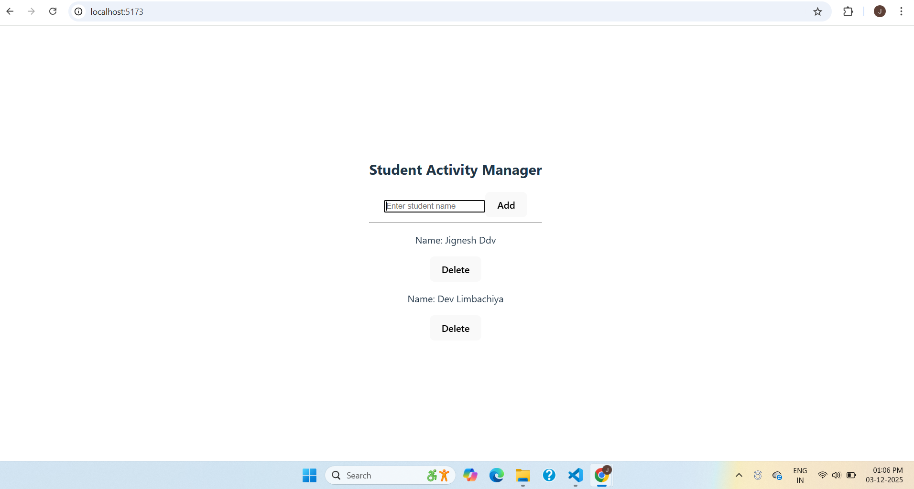

📘 Student Activity Manager

A very simple React project made for beginners to learn:

React State

Events

Refs

Conditional Rendering

List Rendering

Passing Arguments to Event Handlers

This version is intentionally small, clean, and perfect for new learners.

🖼️ Screenshot

Replace the image link with your real screenshot.

🚀 Features

Add student

Delete student

Simple real-time UI updates

Autofocus using refs

Clean layout

Perfect for learning React basics

📚 What You Learn
Concept	Demo in Code
State	useState([])
Refs	nameRef.current.value
Events	onSubmit, onClick
Conditional Rendering	students.length === 0 && ...
List Rendering	.map()
Passing Arguments	deleteStudent(student.id)

▶️ How to Run
npm install
npm start
